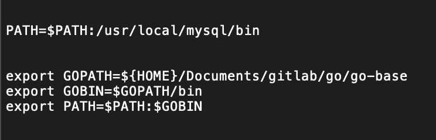

# 1. 安装go https://studygolang.com/dl
# 2. 修改环境变量
    ### 打开 Users/xiaoma/.bash_profile
    ### 也可以打开终端 直接vim ～/.bash_profile
    ### 配置路径：
    export GOPATH=${HOME}/Documents/gitlab/go/go-base
    export GOBIN=$GOPATH/bin
    export PATH=$PATH:$GOBIN
    如下图：
    
    
# 3. 执行下面命令
    $ source ~/.bash_profile
    $ go env
    $ cd $GOPATH/src
    如下图：
    
# 4. 打开 vscode
    1. 左侧菜单选择 扩展
    2. 搜索 go 安装
    如下图：
    
# 5. 打开目录设置的gopath文件
    1. 添加src文件
    2. 添加mian.go
    3. 输入如下代码
    
    package main
    import "fmt"
    func main() {
    	fmt.Println("hello go")
    }
        
    4. 保存
    5. 右下角提示 install all 点击即可
    6. 输出结果如下内容
    Installing 14 tools at F:\Softs\GoLang\repository
      gocode
      gopkgs
      go-outline
      go-symbols
      guru
      gorename
      gomodifytags
      goplay
      impl
      godef
      goreturns
      golint
      gotests
      dlv
    
    Installing github.com/nsf/gocode FAILED
    Installing github.com/uudashr/gopkgs/cmd/gopkgs SUCCEEDED
    Installing github.com/ramya-rao-a/go-outline FAILED
    Installing github.com/acroca/go-symbols FAILED
    Installing golang.org/x/tools/cmd/guru FAILED
    Installing golang.org/x/tools/cmd/gorename FAILED
    Installing github.com/fatih/gomodifytags FAILED
    Installing github.com/haya14busa/goplay/cmd/goplay SUCCEEDED
    Installing github.com/josharian/impl FAILED
    Installing github.com/rogpeppe/godef SUCCEEDED
    Installing sourcegraph.com/sqs/goreturns FAILED
    Installing github.com/golang/lint/golint FAILED
    Installing github.com/cweill/gotests/... FAILED
    Installing github.com/derekparker/delve/cmd/dlv SUCCEEDED
    
    如下图：
     
   6. 执行 go env -w GOPROXY=https://goproxy.cn
   7. 在进行第4步即可
   8. 最终结果
# 6. 执行$ go build main.go
# 7. 执行$ ./main
# 8. 最终结果
    如下图：
     
    

